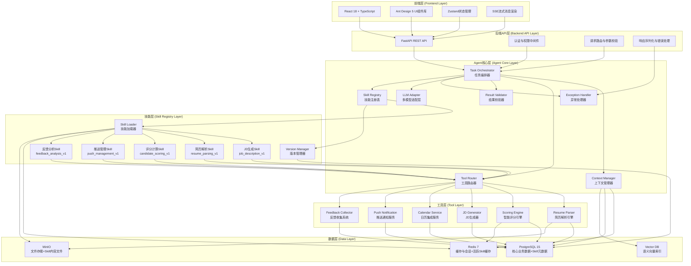
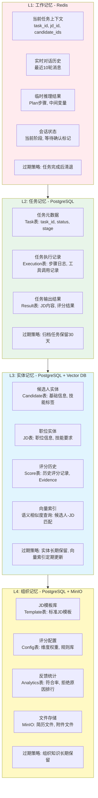
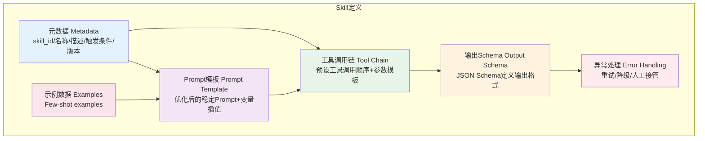
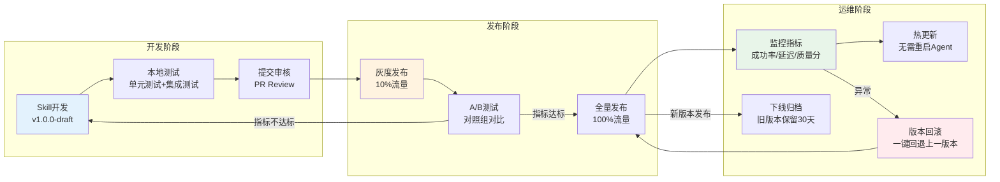
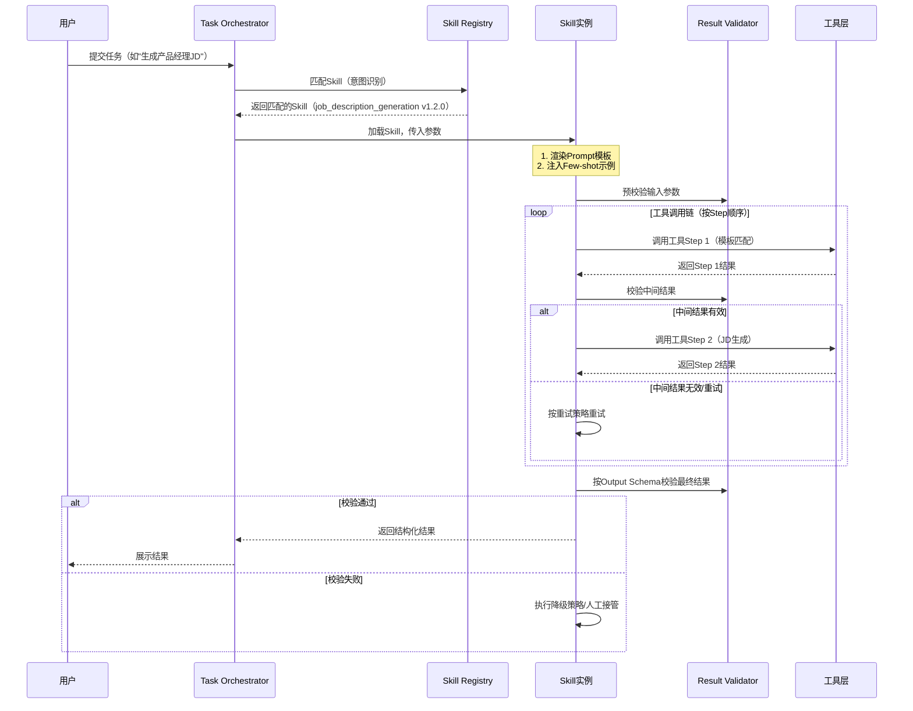
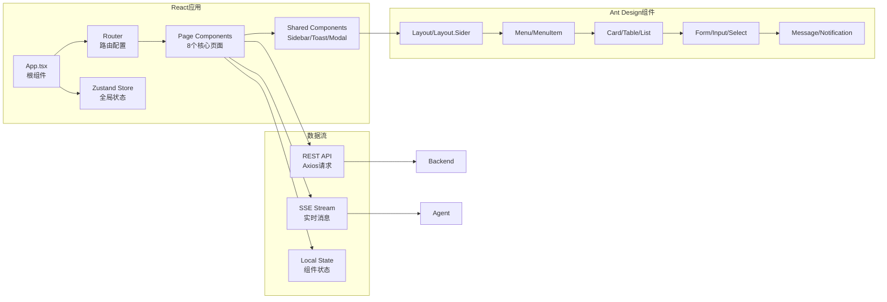
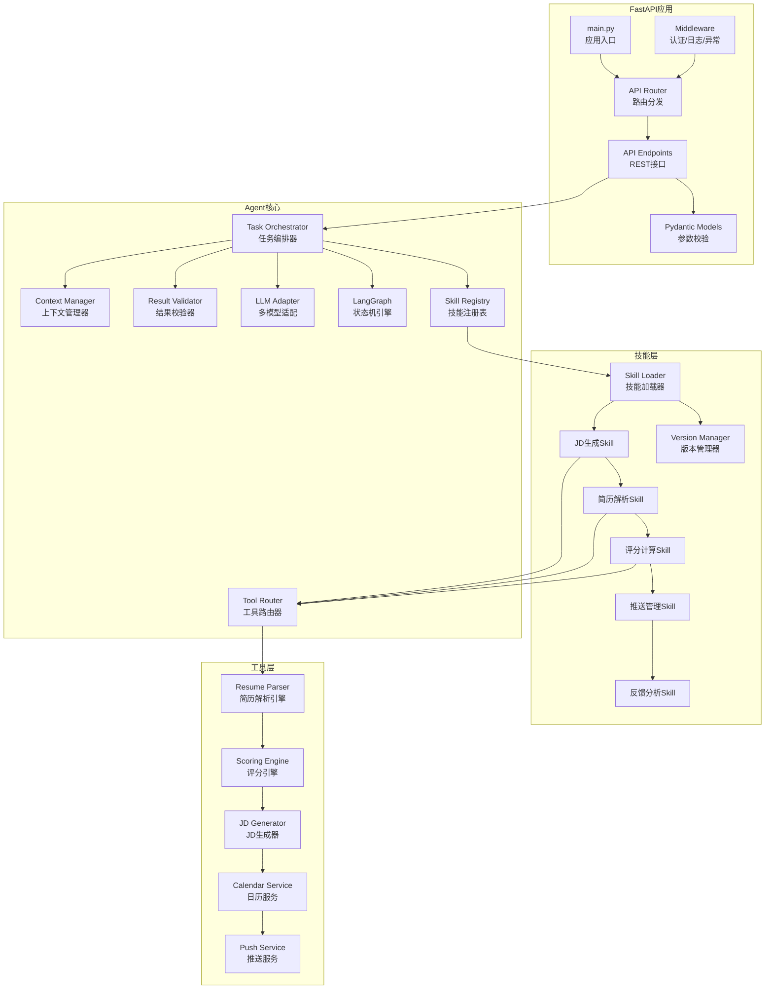
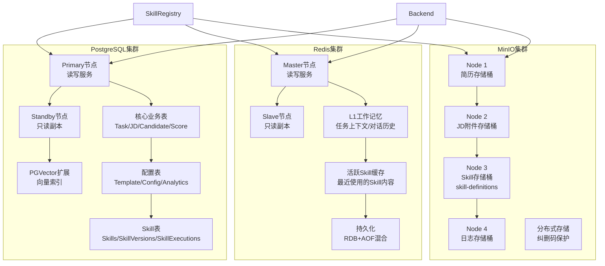
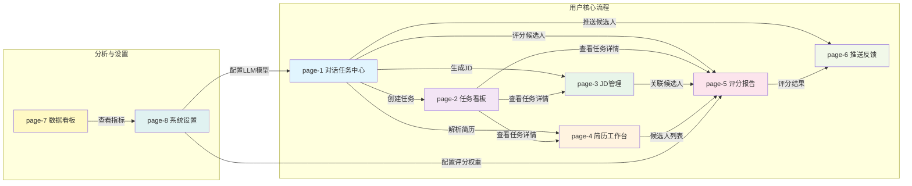

# 智能招聘 Agent 项目架构总览

**版本:** v1.2  
**更新日期:** 2026-07-09  
**文档性质:** 项目整体架构技术文档  
**配套单一事实来源文档:**
- [data-model.md](file:///e:/AI-WORK/Project-Work/recruitment-agent-2.0/docs/data-model.md) — 数据库Schema唯一源
- [api-contract.md](file:///e:/AI-WORK/Project-Work/recruitment-agent-2.0/docs/api-contract.md) — API/SSE契约唯一源
- [development-roadmap.md](file:///e:/AI-WORK/Project-Work/recruitment-agent-2.0/docs/development-roadmap.md) — 开发路线图

> **注意**：当本文档内容与上述单一事实来源文档冲突时，以上述文档为准。

---

## 一、项目概述

### 1.1 产品定位

智能招聘 Agent 是一款面向 HR 和招聘团队的 AI 驱动招聘助手,旨在通过对话式交互实现招聘全流程自动化,从 JD 编写、简历筛选、候选人评分到面试安排和反馈收集,大幅提升招聘效率并降低人工操作负担。

**核心价值主张:**
- **对话驱动:** 用户通过自然语言对话完成招聘任务,无需复杂操作
- **自动化决策:** Agent 自动解析意图、规划步骤、执行工具调用并校验结果
- **透明推理:** 完整展示 R-P-R-A-R 推理过程,用户可实时干预和调整
- **闭环验证:** 每个步骤都有明确的校验机制,确保输出符合预期

### 1.2 核心目标

| 目标维度 | 具体指标 | 优先级 |
|---------|---------|-------|
| **效率提升** | 简历筛选时间从 4 小时/天降至 30 分钟/天 | P0 |
| **决策质量** | Top20% 候选人与人工筛选重合率 > 70% | P0 |
| **用户接受度** | HR 主动使用率 > 80% | P1 |
| **系统稳定性** | 任务完成率 > 95%,错误率 < 1% | P0 |

### 1.3 MVP 范围

MVP 阶段聚焦以下核心功能:

| 模块编号 | 功能名称 | MVP 范围说明 |
|---------|---------|-------------|
| **M1** | 对话任务中心 | 用户通过对话创建任务、执行步骤、查看推理过程 |
| **M2** | JD 管理 | JD 模板库管理、JD 创建/编辑、关联候选人视图 |
| **M3** | 简历工作台 | 简历批量上传、解析进度查看、解析结果展示、人工补录 |
| **M4** | 评分报告 | 评分维度配置、候选人排序、评分详情、evidence 展示 |
| **M5** | 推送反馈 | 推送管理(邮件/IM)、反馈收集(三态)、统计分析 |
| **M6** | 数据看板 | KPI 卡片(任务完成率/评分一致率等)、历史趋势图表 |
| **M7** | 系统设置 | LLM 配置(多模型)、评分引擎参数、系统参数配置 |
| **M8** | 任务看板 | 任务列表/看板视图、任务状态筛选、任务详情入口 |

**Phase 2 扩展功能 (MVP 后):**
- 日历集成 (面试时间自动安排)
- 多轮对话记忆增强 (跨任务上下文复用)
- 简历来源追踪 (渠道效果分析)
- 团队协作 (多 HR 共享任务视图)

---

## 二、系统总体架构

### 2.1 六层架构设计

系统采用六层架构设计,实现清晰的职责分离和模块化开发,在Agent核心层与工具层之间新增Skill Registry技能注册表层:



### 2.2 层次职责说明

| 层次 | 核心职责 | 关键技术 | 交付物形式 |
|-----|---------|---------|-----------|
| **前端层** | 用户交互、状态管理、消息渲染 | React 18、Ant Design 5、Zustand、SSE | SPA 应用 (打包后) |
| **后端 API 层** | 请求处理、路由分发、认证鉴权 | FastAPI、Pydantic、JWT/OAuth | REST API 服务 |
| **Agent 核心层** | 推理编排、上下文管理、技能调度、工具调度 | LangGraph、状态机、技能注册表 | Agent 服务进程 |
| **技能层 (Skill Registry)** | 可复用任务能力封装、技能版本管理、热更新加载 | JSON Schema、Prompt模板、工具链编排 | Skill定义文件+注册表服务 |
| **工具层** | 具体业务逻辑执行 | Python、外部 API 集成 | 工具类库 (被 Skill 调用) |
| **数据层** | 数据持久化、缓存、文件存储、Skill元数据存储 | PostgreSQL、Redis、MinIO | 数据库实例、存储桶 |

---

## 三、Agent 推理框架 (R-P-R-A-R)

### 3.1 六阶段流程设计

智能招聘 Agent 采用 **R-P-R-A-R (Reason-Plan-Reflect-Act-Reflect)** 推理框架,在传统的 ReAct 模型基础上增加"执行前规划"和"双层反思"机制,确保决策可干预和结果可验证。

```mermaid
flowchart LR
    subgraph Stage1[阶段1: Reason - 需求理解]
        R1[接收用户输入]
        R2[意图识别<br/>任务类型分类]
        R3[参数提取<br/>JD字段/候选人ID等]
        R4[歧义检测<br/>缺失信息追问]
    end

    subgraph Stage2[阶段2: Reflect-Reason - 需求反思]
        RR1[需求完整性检查]
        RR2[上下文关联<br/>历史任务记忆]
        RR3[合理性评估<br/>职位匹配度]
        RR4[生成需求确认]
    end

    subgraph Stage3[阶段3: Plan - 执行规划]
        P1[工具选择<br/>四层决策模型]
        P2[步骤分解<br/>生成执行清单]
        P3[参数构建<br/>工具调用参数]
        P4[生成Plan卡片<br/>展示步骤清单]
    end

    subgraph Stage4[阶段4: Reflect-Plan - 规划反思]
        RP1[步骤合理性检查]
        RP2[依赖关系验证<br/>工具调用顺序]
        RP3[风险识别<br/>可能失败点]
        RP4[等待用户确认<br/>调整/跳过/执行]
    end

    subgraph Stage5[阶段5: Act - 工具执行]
        A1[调用工具<br/>简历解析/评分等]
        A2[监控执行进度<br/>SSE实时推送]
        A3[捕获异常<br/>超时/格式错误]
        A4[收集原始结果<br/>工具输出]
    end

    subgraph Stage6[阶段6: Reflect-Act - 结果反思]
        RA1[格式校验<br/>JSON结构检查]
        RA2[逻辑校验<br/>业务规则验证]
        RA3[质量评估<br/>完成度/准确度]
        RA4[生成最终响应<br/>展示给用户]
    end

    R1 --> R2 --> R3 --> R4
    R4 --> RR1 --> RR2 --> RR3 --> RR4
    RR4 --> P1 --> P2 --> P3 --> P4
    P4 --> RP1 --> RP2 --> RP3 --> RP4
    RP4 --> A1 --> A2 --> A3 --> A4
    A4 --> RA1 --> RA2 --> RA3 --> RA4

    style Stage1 fill:#e1f5ff
    style Stage2 fill:#fff4e1
    style Stage3 fill:#e8f5e9
    style Stage4 fill:#fff4e1
    style Stage5 fill:#fce4ec
    style Stage6 fill:#fff4e1
```



### 3.2 各阶段详细职责

| 阶段 | 输入 | 输出 | 核心逻辑 | 用户可见 |
|-----|-----|-----|---------|---------|
| **Reason** | 用户对话输入 | 任务意图、参数集合、歧义标记 | 意图分类器 + 参数提取器 + 缺失检测器 | "我理解您想..." 提示 |
| **Reflect-Reason** | Reason 输出 | 需求确认消息、上下文关联结果 | 完整性检查 + 历史任务查询 + 合理性评估 | "请确认您的需求..." |
| **Plan** | 确认后的需求 | 执行步骤清单、工具调用参数 | 工具路由器(四层决策) + 步骤生成器 | Plan 卡片(步骤清单) |
| **Reflect-Plan** | Plan 输出 | 规划确认消息、风险提示 | 步骤合理性验证 + 依赖检查 + 风险识别 | "请确认执行步骤..." |
| **Act** | 确认后的计划 | 工具执行结果、进度消息 | 工具调用 + 进度监控 + 异常捕获 | Tool Call 卡片 + Progress 消息 |
| **Reflect-Act** | Act 输出 | 最终响应、校验结果 | 格式校验 + 逻辑校验 + 质量评估 | Result 卡片 + Evidence 展示 |

### 3.3 核心创新点

#### 1. 执行前规划 (Plan + Reflect-Plan)

传统 ReAct 模型是"边思考边行动",容易导致工具调用序列不合理或中途失败。本框架在执行前先生成完整计划并展示给用户:

**Plan 阶段输出示例:**
```json
{
  "plan_id": "plan_20260707_001",
  "task_type": "JD_GENERATION",
  "steps": [
    {
      "step_id": 1,
      "tool_name": "jd_template_matcher",
      "description": "从模板库匹配相关JD模板",
      "params": {"keywords": ["产品经理", "AI方向"]},
      "expected_output": "匹配的模板ID列表"
    },
    {
      "step_id": 2,
      "tool_name": "jd_generator",
      "description": "基于模板生成结构化JD",
      "params": {"template_id": "tpl_pm_001", "customizations": {"level": "P7"}},
      "expected_output": "完整的JD JSON"
    },
    {
      "step_id": 3,
      "tool_name": "jd_validator",
      "description": "合规校验(歧视性词汇检测)",
      "params": {"jd_content": "<步骤2输出>"},
      "expected_output": "校验结果(通过/失败+修正建议)"
    }
  ],
  "total_steps": 3,
  "estimated_time": "30秒"
}
```

**用户确认机制:**
- **执行:** 用户点击"执行"按钮,按步骤顺序执行
- **调整:** 用户修改步骤参数或顺序,Agent 重新规划
- **跳过:** 用户跳过某个步骤,Agent 调整后续依赖

#### 2. 双层反思 (Reflect-Reason + Reflect-Act)

**Reflect-Reason (需求反思):**
- 检查用户需求完整性(必填字段是否齐全)
- 关联历史上下文(是否有相关任务记录)
- 评估需求合理性(职位级别与技能匹配度)

**Reflect-Act (结果反思):**
- 格式校验: 输出是否符合预期 JSON 结构
- 逻辑校验: 业务规则是否满足(如评分总分在 0-100 范围)
- 质量评估: 完成度评分(必填字段完整度 > 90%)

#### 3. 流式消息透明化

通过 SSE (Server-Sent Events) 实时推送每个阶段的消息,用户可全程观察推理过程。

> **SSE事件类型、PlanStep结构、Agent交互接口的正式定义见 [api-contract.md](file:///e:/AI-WORK/Project-Work/recruitment-agent-2.0/docs/api-contract.md) §3，本文不再重复定义。**

**核心事件类型概览：**
| 消息类型 | 触发时机 | 内容示例 |
|---------|---------|---------|
| **thinking** | Reason/Reflect 阶段推理 | "正在分析您的需求..." |
| **plan** | Plan 阶段输出 | 步骤清单（含params、expected_output） |
| **tool_call** | Act 阶段开始 | 工具名称 + 调用参数 |
| **progress** | Act 阶段执行中 | "正在解析简历...已完成 3/10" |
| **result** | Reflect-Act 校验通过 | 最终输出 |
| **error** | 发生错误 | 错误码 + 错误信息 |
| **warning** | 警告（不中断流程） | 警告信息 + 建议 |
| **system** | 系统消息 | 连接/心跳等 |

---

## 四、四层记忆架构

### 4.1 L1-L4 记忆层次设计

Agent 采用四层记忆架构,实现短期工作记忆、中期任务记忆、长期实体记忆和组织记忆的分离,避免上下文膨胀并提升推理效率。



### 4.2 各层记忆详细说明

| 层次 | 存储介质 | 内容类型 | 读写频率 | 过期策略 | 数据量估算 |
|-----|---------|---------|---------|---------|-----------|
| **L1** | Redis | 当前任务上下文、对话历史、临时变量 | 每秒多次 | 任务完成后清退 | 每任务 < 10KB |
| **L2** | PostgreSQL | 任务元数据、执行记录、输出结果 | 每分钟多次 | 归档任务保留 30 天 | 每任务 < 100KB |
| **L3** | PostgreSQL + Vector DB | 候选人实体、JD实体、评分历史、向量索引 | 每小时多次 | 实体长期保留, 向量索引每周更新 | 候选人 < 1000 条, JD < 200 条 |
| **L4** | PostgreSQL + MinIO | JD模板库、评分配置、反馈统计、文件存储 | 每天 | 组织知识长期保留 | 模板 < 50 条, 配置 < 20 条, 文件 < 10GB |

### 4.3 L1 工作记忆管理

**Redis 键设计:**

```python
# L1 工作记忆键命名规范
REDIS_KEYS = {
    "task_context": "task:{task_id}:context",          # 当前任务上下文
    "dialog_history": "task:{task_id}:dialog",         # 最近10轮对话
    "plan_steps": "task:{task_id}:plan",               # Plan步骤清单
    "intermediate_vars": "task:{task_id}:vars",        # 中间变量(如解析进度)
    "session_state": "task:{task_id}:state",           # 会话状态(当前阶段)
    "temp_evidence": "task:{task_id}:evidence",        # 临时Evidence缓存
}

# 示例: 当前任务上下文结构
{
    "task_id": "task_20260707_001",
    "jd_id": "jd_pm_001",
    "candidate_ids": ["cand_001", "cand_002", "cand_003"],
    "current_stage": "REFLECT_PLAN",
    "waiting_for_user": True,
    "user_intent": "SCORE_CANDIDATES",
    "extracted_params": {
        "jd_id": "jd_pm_001",
        "candidate_filter": {"min_experience": 3}
    }
}
```

**过期策略:**
- 任务完成后(状态=ARCHIVED)立即清退 L1 记忆
- 任务超时(> 2 小时未完成)自动清退
- 用户主动取消任务时清退

### 4.4 L2 任务记忆管理

**PostgreSQL 表设计 (L2 部分):**

```sql
-- Task表: 任务元数据
CREATE TABLE tasks (
    task_id VARCHAR(50) PRIMARY KEY,
    user_id VARCHAR(50) NOT NULL,
    task_type VARCHAR(30) NOT NULL,  -- JD_GENERATION / RESUME_PARSE / SCORE_CANDIDATES
    status VARCHAR(20) NOT NULL,     -- CREATED / IN_PROGRESS / COMPLETED / ARCHIVED / FAILED
    stage VARCHAR(30),               -- REASON / REFLECT_REASON / PLAN / REFLECT_PLAN / ACT / REFLECT_ACT
    jd_id VARCHAR(50),
    created_at TIMESTAMP DEFAULT NOW(),
    updated_at TIMESTAMP DEFAULT NOW(),
    completed_at TIMESTAMP,
    error_message TEXT
);

-- Execution表: 任务执行记录
CREATE TABLE executions (
    execution_id SERIAL PRIMARY KEY,
    task_id VARCHAR(50) REFERENCES tasks(task_id),
    step_id INT NOT NULL,
    tool_name VARCHAR(50),
    input_params JSONB,
    output_result JSONB,
    execution_status VARCHAR(20),    -- SUCCESS / FAILED / TIMEOUT
    started_at TIMESTAMP,
    finished_at TIMESTAMP,
    error_details TEXT
);

-- Result表: 任务输出结果
CREATE TABLE results (
    result_id SERIAL PRIMARY KEY,
    task_id VARCHAR(50) REFERENCES tasks(task_id),
    result_type VARCHAR(30),         -- JD / SCORE / PUSH
    result_content JSONB NOT NULL,
    validation_score FLOAT,          -- Reflect-Act质量评分(0-1)
    created_at TIMESTAMP DEFAULT NOW()
);
```

### 4.5 L3 实体记忆管理

**PostgreSQL + Vector DB 混合存储:**

```sql
-- Candidate表: 候选人实体
CREATE TABLE candidates (
    candidate_id VARCHAR(50) PRIMARY KEY,
    name VARCHAR(100) NOT NULL,
    email VARCHAR(100),
    phone VARCHAR(20),
    education JSONB,                  -- [{"level": "硕士", "school": "清华大学", "major": "计算机"}]
    experience JSONB,                 -- [{"company": "字节跳动", "role": "产品经理", "years": 3}]
    skills JSONB,                     -- ["产品设计", "数据分析", "AI产品"]
    created_at TIMESTAMP DEFAULT NOW(),
    updated_at TIMESTAMP DEFAULT NOW()
);

-- JD表: 职位实体
CREATE TABLE jds (
    jd_id VARCHAR(50) PRIMARY KEY,
    title VARCHAR(100) NOT NULL,
    department VARCHAR(50),
    level VARCHAR(20),                -- P5/P6/P7/P8
    skills_required JSONB,            -- ["产品设计", "数据分析"]
    requirements JSONB,               -- 结构化JD内容
    created_by VARCHAR(50),
    created_at TIMESTAMP DEFAULT NOW(),
    updated_at TIMESTAMP DEFAULT NOW(),
    status VARCHAR(20) DEFAULT 'ACTIVE'  -- ACTIVE / ARCHIVED
);

-- Score表: 评分历史(建立Candidate-JD双向关联)
CREATE TABLE scores (
    score_id SERIAL PRIMARY KEY,
    candidate_id VARCHAR(50) REFERENCES candidates(candidate_id),
    jd_id VARCHAR(50) REFERENCES jds(jd_id),
    skill_match_score FLOAT,          -- 技能匹配维度
    experience_score FLOAT,           -- 经验匹配维度
    education_score FLOAT,            -- 教育匹配维度
    stability_score FLOAT,            -- 稳定性维度
    potential_score FLOAT,            -- 潜力维度
    total_score FLOAT,                -- 总分(加权计算)
    evidence JSONB,                   -- {"skill_match": ["产品设计:完全匹配", "数据分析:部分匹配"]}
    scored_by VARCHAR(50),            -- Agent实例ID或人工评分ID
    scored_at TIMESTAMP DEFAULT NOW(),
    UNIQUE(candidate_id, jd_id)       -- 同一候选人-同一JD只评分一次
);
```

**向量索引设计 (候选人-JD语义匹配):**

```python
# 使用PGVector扩展(PostgreSQL向量插件)
# 安装: CREATE EXTENSION vector;

CREATE TABLE candidate_vectors (
    candidate_id VARCHAR(50) PRIMARY KEY REFERENCES candidates(candidate_id),
    embedding VECTOR(1536),           -- OpenAI embedding维度
    metadata JSONB                    -- 原始文本片段(用于相似度查询展示)
);

CREATE TABLE jd_vectors (
    jd_id VARCHAR(50) PRIMARY KEY REFERENCES jds(jd_id),
    embedding VECTOR(1536),
    metadata JSONB
);

-- 相似度查询示例
SELECT candidate_id, metadata, 
       1 - (embedding <=> query_vector) AS similarity_score
FROM candidate_vectors
ORDER BY embedding <=> query_vector
LIMIT 20;
```

### 4.6 L4 组织记忆管理

**PostgreSQL 表设计 (L4 部分):**

```sql
-- Template表: JD模板库
CREATE TABLE templates (
    template_id VARCHAR(50) PRIMARY KEY,
    template_name VARCHAR(100) NOT NULL,
    template_type VARCHAR(30),        -- PM / DEV / DESIGN / OPS
    template_content JSONB,           -- 标准JD模板字段
    usage_count INT DEFAULT 0,        -- 使用次数(用于排序推荐)
    created_at TIMESTAMP DEFAULT NOW(),
    updated_at TIMESTAMP DEFAULT NOW()
);

-- Config表: 评分配置
CREATE TABLE configs (
    config_id VARCHAR(50) PRIMARY KEY,
    config_type VARCHAR(30),          -- SCORING_WEIGHT / LLM_MODEL / SYSTEM_PARAM
    config_key VARCHAR(100) UNIQUE,
    config_value JSONB,
    description TEXT,
    created_at TIMESTAMP DEFAULT NOW(),
    updated_at TIMESTAMP DEFAULT NOW()
);

-- Analytics表: 反馈统计
CREATE TABLE analytics (
    analytic_id SERIAL PRIMARY KEY,
    metric_type VARCHAR(50),          -- ACCEPTANCE_RATE / REJECTION_REASON / TASK_SUCCESS_RATE
    metric_value FLOAT,
    metric_date DATE,
    details JSONB,
    created_at TIMESTAMP DEFAULT NOW()
);

-- Skills表: Skill元数据
CREATE TABLE skills (
    skill_id VARCHAR(100) PRIMARY KEY,
    skill_name VARCHAR(200) NOT NULL,
    description TEXT,
    current_version VARCHAR(20) NOT NULL,  -- 当前稳定版本
    status VARCHAR(20) DEFAULT 'ACTIVE',   -- DRAFT / ACTIVE / DEPRECATED / ARCHIVED
    author VARCHAR(100),
    tags JSONB,                            -- ["JD", "简历解析", "评分"]
    trigger_conditions JSONB,              -- 触发条件配置
    created_at TIMESTAMP DEFAULT NOW(),
    updated_at TIMESTAMP DEFAULT NOW()
);

-- SkillVersions表: Skill版本信息
CREATE TABLE skill_versions (
    version_id SERIAL PRIMARY KEY,
    skill_id VARCHAR(100) REFERENCES skills(skill_id),
    version VARCHAR(20) NOT NULL,          -- 语义化版本号 1.2.0
    minio_path VARCHAR(500) NOT NULL,      -- MinIO中skill.json路径
    output_schema JSONB,                   -- 输出JSON Schema
    tool_chain JSONB,                      -- 工具调用链配置
    error_handling JSONB,                  -- 异常处理策略
    changelog TEXT,                        -- 版本变更说明
    status VARCHAR(20) DEFAULT 'DRAFT',    -- DRAFT / CANARY / ACTIVE / ROLLED_BACK / DEPRECATED
    traffic_weight FLOAT DEFAULT 0,        -- 流量权重(0-1,用于灰度)
    success_rate FLOAT,                    -- 成功率(监控指标)
    avg_latency_ms INT,                    -- 平均延迟
    quality_score FLOAT,                   -- 质量评分
    created_by VARCHAR(100),
    created_at TIMESTAMP DEFAULT NOW(),
    published_at TIMESTAMP,
    UNIQUE(skill_id, version)
);

-- SkillExecutions表: Skill执行记录(用于A/B测试和效果分析)
CREATE TABLE skill_executions (
    execution_id SERIAL PRIMARY KEY,
    skill_id VARCHAR(100) REFERENCES skills(skill_id),
    version VARCHAR(20) NOT NULL,
    task_id VARCHAR(50),
    user_id VARCHAR(50),
    input_params JSONB,
    output_result JSONB,
    execution_status VARCHAR(20),          -- SUCCESS / FAILED / FALLBACK / HUMAN_HANDOFF
    execution_time_ms INT,
    validation_score FLOAT,
    error_message TEXT,
    executed_at TIMESTAMP DEFAULT NOW()
);

CREATE INDEX idx_skill_versions_skill_id ON skill_versions(skill_id);
CREATE INDEX idx_skill_versions_status ON skill_versions(status);
CREATE INDEX idx_skill_executions_skill_version ON skill_executions(skill_id, version);
CREATE INDEX idx_skill_executions_executed_at ON skill_executions(executed_at);
```

**Skill存储方案说明：**

| 存储介质 | 存储内容 | 读写特性 | 过期策略 |
|---------|---------|---------|---------|
| **PostgreSQL** | Skill元数据、版本信息、执行记录 | 读写频繁，强一致性 | 元数据长期保留，执行记录保留90天 |
| **MinIO** | Skill内容文件（skill.json、prompt模板、示例数据） | 读多写少，大文件存储 | 已归档版本保留30天后清理 |
| **Redis** | 活跃Skill缓存（最近24小时使用的Skill） | 读极频繁，毫秒级响应 | LRU淘汰，缓存TTL=1小时 |

**Redis缓存键设计：**
```python
REDIS_SKILL_KEYS = {
    "active_skill": "skill:active:{skill_id}",           # 当前活跃版本Skill内容
    "skill_version": "skill:version:{skill_id}:{version}", # 指定版本Skill内容
    "skill_registry": "skill:registry:index",            # Skill注册表索引(skill_id->version映射)
    "skill_stats": "skill:stats:{skill_id}:{version}",   # Skill实时统计数据
}

# 活跃Skill缓存结构
{
    "skill_id": "job_description_generation",
    "version": "1.2.0",
    "loaded_at": "2026-07-08T10:30:00Z",
    "content": { ... },  # 完整skill.json内容
    "hit_count": 1250
}
```

**MinIO 文件存储:**

```python
# MinIO存储桶设计
MINIO_BUCKETS = {
    "resumes": "resume-files",        # 简历原始文件(PDF/DOCX)
    "jd_attachments": "jd-files",     # JD附件文件
    "agent_logs": "agent-logs",       # Agent执行日志文件
    "skills": "skill-definitions",    # Skill内容文件(Prompt/示例/配置)
}

# 文件命名规范
# 简历文件: resumes/{candidate_id}/{original_filename}
# JD附件: jd_attachments/{jd_id}/{attachment_filename}
# Skill文件: skills/{skill_id}/{version}/skill.json
```

---

## 五、Skills技能库架构

### 5.1 Skills的定位

Skills（技能）是可复用的任务能力包，封装了固定类型任务的完整执行逻辑，包括：
- 优化后的稳定Prompt模板
- 预设的工具调用链
- 标准化的输出格式校验
- 内置的异常处理策略

**Skill vs Tool 对比：**

| 维度 | Tool（工具） | Skill（技能） |
|-----|------------|-------------|
| 粒度 | 原子操作（单步） | 任务能力包（多步） |
| 复用性 | 被Skill/Agent直接调用 | 可独立版本化、热更新 |
| Prompt | 无内置Prompt | 内置优化后的稳定Prompt |
| 输出校验 | 无内置校验 | 内置JSON Schema校验 |
| 异常处理 | 抛出异常 | 内置重试/降级/人工接管策略 |
| 示例数据 | 无 | 内置Few-shot examples |

### 5.2 Skill契约唯一性说明

> **重要设计决策（消除双定义歧义）：**
> - **唯一契约来源**：`skill.yaml`（元数据+I/O Schema+工具链配置）+ `prompt.md`（Prompt模板）+ `examples.yaml`（Few-shot示例）—— 这三个文件是Skill的唯一契约定义
> - **Python运行时角色**：`BaseSkill` 抽象基类**仅作运行时加载/校验/执行引擎**，负责：
>   1. 从YAML/Markdown文件加载Skill定义
>   2. 输入参数的JSON Schema校验
>   3. Prompt渲染（Jinja2模板）
>   4. 工具链调用与重试/降级
>   5. 输出校验与合规检查
> - **禁止**：不要在Python代码中硬编码Prompt、Schema或业务逻辑，所有可变部分必须放在YAML/Markdown文件中

**目录结构规范（实际实现）：**
```
app/agent/skills/{skill_id}/
└── v{major}_{minor}_{patch}/
    ├── skill.yaml      # 唯一契约：元数据+I/O Schema+工具链
    ├── prompt.md       # System Prompt + User Template（用---USER_TEMPLATE---分隔）
    └── examples.yaml   # Few-shot示例
```

### 5.3 Skill组成结构

每个Skill由以下6个核心部分组成：



**Skill Python基类定义：**

```python
from abc import ABC, abstractmethod
from typing import Any, Dict, List, Optional
from pydantic import BaseModel, Field
import jsonschema
from jinja2 import Template
import time

class SkillStep(BaseModel):
    step_id: int
    tool_name: str
    description: str
    params_template: Dict[str, Any]
    output_mapping: Dict[str, str] = Field(default_factory=dict)
    timeout_seconds: int = 30
    retry_count: int = 0

class RetryPolicy(BaseModel):
    max_retries: int = 2
    backoff_strategy: str = "exponential"
    initial_delay_ms: int = 1000
    retryable_errors: List[str] = Field(default_factory=list)

class FallbackStrategy(BaseModel):
    enabled: bool = False
    fallback_skill_id: Optional[str] = None
    fallback_version: Optional[str] = None
    trigger_conditions: List[str] = Field(default_factory=list)

class HumanHandoff(BaseModel):
    enabled: bool = False
    conditions: List[str] = Field(default_factory=list)
    handoff_message: str = ""
    escalation_level: str = "HR_OPERATOR"

class ErrorHandling(BaseModel):
    retry_policy: RetryPolicy = Field(default_factory=RetryPolicy)
    fallback_strategy: FallbackStrategy = Field(default_factory=FallbackStrategy)
    human_handoff: HumanHandoff = Field(default_factory=HumanHandoff)

class SkillDefinition(BaseModel):
    skill_id: str
    name: str
    description: str
    version: str
    trigger_conditions: Dict[str, Any]
    prompt_template: Dict[str, Any]
    tool_chain: Dict[str, Any]
    output_schema: Dict[str, Any]
    error_handling: ErrorHandling
    metadata: Dict[str, Any] = Field(default_factory=dict)

class BaseSkill(ABC):
    def __init__(self, definition: SkillDefinition):
        self.definition = definition
        self.execution_context: Dict[str, Any] = {}
        self.intermediate_results: Dict[str, Any] = {}

    def render_prompt(self, user_params: Dict[str, Any]) -> str:
        template = Template(self.definition.prompt_template["user_prompt_template"])
        return template.render(**user_params, **self.intermediate_results)

    def validate_output(self, output: Dict[str, Any]) -> tuple[bool, List[str]]:
        try:
            jsonschema.validate(instance=output, schema=self.definition.output_schema)
            return True, []
        except jsonschema.ValidationError as e:
            return False, [e.message]

    def execute_step(self, step: SkillStep, tool_router) -> Dict[str, Any]:
        for attempt in range(step.retry_count + 1):
            try:
                params = self._render_params(step.params_template)
                result = tool_router.call_tool(
                    tool_name=step.tool_name,
                    params=params,
                    timeout=step.timeout_seconds
                )
                self._map_outputs(step.output_mapping, result)
                return result
            except Exception as e:
                if attempt < step.retry_count and self._is_retryable(e):
                    delay = self._calculate_backoff(attempt)
                    time.sleep(delay / 1000)
                    continue
                raise

    def _render_params(self, template: Dict[str, Any]) -> Dict[str, Any]:
        rendered = {}
        for key, value in template.items():
            if isinstance(value, str) and value.startswith("{{") and value.endswith("}}"):
                var_name = value[2:-2].strip()
                rendered[key] = self.intermediate_results.get(var_name, self.execution_context.get(var_name))
            elif isinstance(value, dict):
                rendered[key] = self._render_params(value)
            else:
                rendered[key] = value
        return rendered

    def _map_outputs(self, mapping: Dict[str, str], result: Dict[str, Any]):
        for output_key, context_key in mapping.items():
            if output_key in result:
                self.intermediate_results[context_key] = result[output_key]

    def _is_retryable(self, error: Exception) -> bool:
        error_type = type(error).__name__
        return error_type in self.definition.error_handling.retry_policy.retryable_errors

    def _calculate_backoff(self, attempt: int) -> int:
        policy = self.definition.error_handling.retry_policy
        if policy.backoff_strategy == "exponential":
            return policy.initial_delay_ms * (2 ** attempt)
        return policy.initial_delay_ms

    @abstractmethod
    def execute(self, user_params: Dict[str, Any], tool_router, llm_adapter) -> Dict[str, Any]:
        pass
```

**Skill定义示例（JD生成Skill）：**

```json
{
  "skill_id": "job_description_generation",
  "name": "JD生成Skill",
  "description": "基于职位名称和要求生成结构化JD，包含合规校验",
  "version": "1.2.0",
  "trigger_conditions": {
    "intent_types": ["JD_GENERATION", "JD_CREATE"],
    "keywords": ["生成JD", "写职位描述", "创建岗位"],
    "priority": 10
  },
  "prompt_template": {
    "system_prompt": "你是一位专业的HR招聘专家，负责生成高质量的职位描述...",
    "user_prompt_template": "请为以下职位生成JD：\n职位名称：{{title}}\n部门：{{department}}\n级别：{{level}}\n技能要求：{{skills}}\n其他要求：{{requirements}}",
    "variables": ["title", "department", "level", "skills", "requirements"],
    "few_shot_examples": [
      {
        "input": {"title": "产品经理", "department": "AI产品部", "level": "P7", "skills": ["AI产品", "数据分析"], "requirements": "3年以上经验"},
        "output": {
          "job_title": "AI产品经理",
          "responsibilities": ["负责AI产品规划...", "..."],
          "requirements": ["3年以上AI产品经验...", "..."]
        }
      }
    ]
  },
  "tool_chain": {
    "execution_mode": "sequential",
    "steps": [
      {
        "step_id": 1,
        "tool_name": "jd_template_matcher",
        "description": "匹配最相关的JD模板",
        "params_template": {"keywords": ["{{title}}", "{{department}}"]},
        "output_mapping": {"template_id": "matched_template_id"},
        "timeout_seconds": 5,
        "retry_count": 2
      },
      {
        "step_id": 2,
        "tool_name": "jd_generator",
        "description": "基于模板生成JD内容",
        "params_template": {
          "template_id": "{{matched_template_id}}",
          "customizations": {
            "title": "{{title}}",
            "level": "{{level}}",
            "skills": "{{skills}}"
          }
        },
        "output_mapping": {"jd_content": "generated_jd"},
        "timeout_seconds": 30,
        "retry_count": 1
      },
      {
        "step_id": 3,
        "tool_name": "jd_compliance_checker",
        "description": "合规校验（歧视性词汇检测）",
        "params_template": {"jd_content": "{{generated_jd}}"},
        "output_mapping": {"compliance_result": "validation_result"},
        "timeout_seconds": 10,
        "retry_count": 0
      }
    ],
    "on_failure": "stop_and_report"
  },
  "output_schema": {
    "type": "object",
    "required": ["job_title", "responsibilities", "requirements", "compliance_status"],
    "properties": {
      "job_title": {"type": "string", "minLength": 2, "maxLength": 100},
      "department": {"type": "string"},
      "level": {"type": "string", "enum": ["P5", "P6", "P7", "P8", "P9"]},
      "responsibilities": {"type": "array", "items": {"type": "string"}, "minItems": 3},
      "requirements": {"type": "array", "items": {"type": "string"}, "minItems": 3},
      "salary_range": {"type": "object", "properties": {"min": {"type": "number"}, "max": {"type": "number"}}},
      "compliance_status": {"type": "string", "enum": ["PASSED", "WARNING", "FAILED"]},
      "compliance_issues": {"type": "array", "items": {"type": "string"}}
    }
  },
  "error_handling": {
    "retry_policy": {
      "max_retries": 2,
      "backoff_strategy": "exponential",
      "initial_delay_ms": 1000,
      "retryable_errors": ["TIMEOUT", "LLM_RATE_LIMIT", "TEMPORARY_FAILURE"]
    },
    "fallback_strategy": {
      "enabled": true,
      "fallback_skill_id": "job_description_generation_basic",
      "fallback_version": "1.0.0",
      "trigger_conditions": ["ALL_RETRIES_FAILED", "COMPLIANCE_CHECK_FAILED"]
    },
    "human_handoff": {
      "enabled": true,
      "conditions": ["FALLBACK_FAILED", "VALIDATION_SCORE_BELOW_THRESHOLD"],
      "handoff_message": "JD生成遇到问题，请人工介入处理",
      "escalation_level": "HR_OPERATOR"
    }
  },
  "metadata": {
    "author": "recruitment-agent-team",
    "created_at": "2026-07-01T00:00:00Z",
    "updated_at": "2026-07-07T00:00:00Z",
    "tags": ["JD", "招聘", "内容生成"],
    "avg_success_rate": 0.94,
    "avg_execution_time_seconds": 18
  }
}
```

### 5.3 核心Skills清单

| Skill ID | 名称 | 版本 | 核心能力 | 依赖工具 | 触发场景 |
|----------|------|------|---------|---------|---------|
| `job_description_generation` | JD生成Skill | v1.2.0 | 模板匹配+内容生成+合规校验 | jd_template_matcher, jd_generator, jd_compliance_checker | 用户说"帮我生成一个产品经理JD" |
| `resume_parsing` | 简历解析Skill | v1.1.0 | 文件解析+信息抽取+结构化输出 | resume_file_parser, llm_extractor, candidate_matcher | 用户上传简历或说"解析这几份简历" |
| `candidate_scoring` | 评分计算Skill | v1.3.0 | 多维度评分+Evidence生成+排序 | scoring_dimension_calculator, evidence_generator, score_aggregator | 用户说"给这些候选人打分"或"按匹配度排序" |
| `push_management` | 推送管理Skill | v1.0.0 | 渠道选择+模板渲染+状态追踪 | email_sender, im_sender, push_tracker | 用户说"给Top10候选人发面试邀请" |
| `feedback_analysis` | 反馈分析Skill | v1.0.0 | 反馈收集+原因分类+统计分析 | feedback_collector, feedback_classifier, analytics_aggregator | 用户说"分析一下本周的面试反馈" |

### 5.4 Skills版本管理

Skill Registry支持完整的版本管理生命周期：



**版本管理核心功能：**

1. **语义化版本号**：遵循SemVer规范（MAJOR.MINOR.PATCH）
   - MAJOR：不兼容的API变更
   - MINOR：向后兼容的功能新增
   - PATCH：向后兼容的问题修复

2. **灰度发布**：
   ```python
   # 灰度发布配置示例
   ROLLOUT_CONFIG = {
       "skill_id": "candidate_scoring",
       "new_version": "1.3.0",
       "stable_version": "1.2.0",
       "rollout_strategy": "gradual",
       "traffic_allocation": {
           "1.3.0": 0.1,    # 10%流量到新版本
           "1.2.0": 0.9     # 90%流量到稳定版
       },
       "canary_users": ["hr_admin_001", "hr_test_user"],  # 金丝雀用户
       "success_criteria": {
           "min_success_rate": 0.92,
           "max_avg_latency_ms": 5000,
           "min_quality_score": 0.85
       }
   }
   ```

3. **A/B测试支持**：
   - 同一Skill多版本并行运行
   - 按用户/任务ID哈希分流
   - 实时对比指标（成功率、质量分、用户接受度）

4. **热更新机制**：
   - Skill文件变更后自动检测（文件监听/轮询）
   - 新请求使用新版本，正在执行的任务继续使用旧版本
   - 无需重启Agent服务，零停机更新

5. **一键回滚**：
   ```python
   # 回滚API示例
   POST /api/skills/{skill_id}/rollback
   {
       "target_version": "1.2.0",
       "reason": "新版本质量分下降10%",
       "rollback_strategy": "immediate"  # immediate / graceful
   }
   ```

### 5.5 Skill执行流程



---

## 六、技术栈总览

### 6.1 前端技术栈

| 技术组件 | 版本 | 选型理由 | 核心用途 |
|---------|-----|---------|---------|
| **React** | 18.2 | 组件化架构、声明式渲染、生态成熟 | SPA 应用基础框架 |
| **TypeScript** | 5.0 | 类型安全、IDE 支持、代码可维护性 | 前端代码语言 |
| **Ant Design** | 5.4 | 企业级 UI 组件库、丰富组件、主题定制 | UI 组件库 |
| **Zustand** | 4.4 | 轻量级状态管理、Hooks API、性能优秀 | 全局状态管理(任务列表、用户信息) |
| **React Router** | 6.14 | SPA 路由管理、嵌套路由、懒加载 | 页面路由管理 |
| **Axios** | 1.4 | HTTP 客户端、拦截器、请求取消 | REST API 请求 |
| **SSE Client** | 自研 | Server-Sent Events、流式消息、重连机制 | Agent 消息实时接收 |

**前端技术架构图:**



### 6.2 后端技术栈

| 技术组件 | 版本 | 选型理由 | 核心用途 |
|---------|-----|---------|---------|
| **Python** | 3.11 | 性能优化、异步支持、生态丰富 | 后端开发语言 |
| **FastAPI** | 0.103 | 高性能、自动 API 文档、异步支持 | REST API 框架 |
| **Pydantic** | 2.4 | 数据校验、序列化、类型约束 | API 参数校验、Skill Schema校验 |
| **LangGraph** | 0.0.50 | Agent 状态机、工具编排、流程可视化 | Agent 推理框架 |
| **SQLAlchemy** | 2.0 | ORM、异步支持、查询优化 | PostgreSQL 数据访问 |
| **Redis-py** | 5.0 | Redis 客户端、异步支持、连接池 | L1 工作记忆、Skill缓存 |
| **MinIO Python SDK** | 7.1.0 | 文件存储客户端、上传下载 | 简历文件存储、Skill内容文件 |
| **Jsonschema** | 4.19 | JSON Schema校验、输出格式验证 | Skill输出结果校验 |
| **Jinja2** | 3.1 | 模板引擎、变量插值 | Skill Prompt模板渲染 |
| **Watchdog** | 3.0 | 文件系统监听、热重载 | Skill热更新文件监听 |

**后端技术架构图:**



### 6.3 数据库技术栈

| 技术组件 | 版本 | 选型理由 | 核心用途 |
|---------|-----|---------|---------|
| **PostgreSQL** | 15 | 成熟稳定、JSONB 支持、索引优化、事务完整性 | 核心业务数据+Skill元数据存储(L2/L3/L4) |
| **Redis** | 7.0 | 高性能缓存、数据结构丰富、持久化支持 | L1 工作记忆缓存、活跃Skill缓存 |
| **MinIO** | RELEASE.2023-12 | 开源对象存储、S3 API 兼容、分布式支持 | 简历文件、Skill内容文件存储 |
| **PGVector** | 0.5.0 | PostgreSQL 向量扩展、相似度查询 | L3 实体语义匹配索引 |

**数据库架构图:**



### 6.4 工具与服务

| 工具/服务 | 选型理由 | 核心用途 |
|---------|---------|---------|
| **OpenAI API** | 性能优秀、生态成熟、文档完善 | 主力 LLM 服务(GPT-4o) |
| **Azure OpenAI** | 企业合规、数据安全、稳定性高 | 企业场景 LLM 服务(可选) |
| **Google Calendar API** | 市场占有率高、API 完善、企业集成 | Phase 2 面试时间安排 |
| **Outlook Calendar API** | 企业邮件系统、Office 365 集成 | Phase 2 面试时间安排(可选) |
| **企业微信 API** | 国内企业常用、推送集成、通知触达 | 推送通知服务(Phase 2) |
| **SMTP 服务** | 通用邮件推送、成本低、覆盖广 | 推送通知服务(MVP) |

---

## 七、MVP 核心功能模块概览

### 7.1 八个核心模块职责

| 模块 | 页面编号 | 核心职责 | Agent 能力集成 | 数据依赖 |
|-----|---------|---------|-------------|---------|
| **对话任务中心** | page-1 | 用户通过对话创建任务、执行步骤、查看推理过程 | R-P-R-A-R 推理框架、SSE 流式消息 | Task 表、L1 工作记忆 |
| **任务看板** | page-2 | 任务列表/看板视图、状态筛选、任务详情入口 | 任务状态查询、状态筛选 | Task 表、JD 表(关联查询) |
| **JD 管理** | page-3 | JD 模板库管理、JD 创建/编辑、关联候选人视图 | JD 生成 Agent、模板匹配算法 | JD 表、Template 表、Candidate 表 |
| **简历工作台** | page-4 | 简历批量上传、解析进度查看、解析结果展示 | 简历解析引擎、候选人管理 | Resume 表、Candidate 表、MinIO |
| **评分报告** | page-5 | 评分维度配置、候选人排序、评分详情、evidence 展示 | 评分引擎(5 维度计算)、权重调整 | Score 表、Candidate 表、JD 表、Config 表 |
| **推送反馈** | page-6 | 推送管理(邮件/IM)、反馈收集(三态)、统计分析 | 推送服务、反馈收集 Agent | Push 表、Feedback 表、Analytics 表 |
| **数据看板** | page-7 | KPI 卡片、历史趋势图表、指标可视化 | 指标采集服务、趋势分析 | Analytics 表、Task 表、Score 表 |
| **系统设置** | page-8 | LLM 配置、评分引擎参数、系统参数配置 | 配置管理 Agent、连通性测试 | Config 表、LLM API 配置 |

### 7.2 模块间交互关系



---

## 八、项目目录结构建议

### 8.1 前端目录结构

```
frontend/
├── package.json              # 依赖配置
├── tsconfig.json             # TypeScript配置
├── vite.config.ts            # Vite构建配置
├── src/
│   ├── main.tsx              # 应用入口
│   ├── App.tsx               # 根组件(路由配置)
│   ├── api/                  # API请求模块
│   │   ├── client.ts         # Axios客户端配置
│   │   ├── taskApi.ts        # 任务API
│   │   ├── jdApi.ts          # JD API
│   │   ├── resumeApi.ts      # 简历API
│   │   ├── scoreApi.ts       # 评分API
│   │   └── sseClient.ts       # SSE客户端
│   ├── store/                # Zustand状态管理
│   │   ├── taskStore.ts      # 任务状态
│   │   ├── userStore.ts      # 用户状态
│   │   ├── jdStore.ts        # JD状态
│   │   └── candidateStore.ts # 候选人状态
│   ├── pages/                # 8个核心页面
│   │   ├── Page1TaskCenter.tsx   # page-1 对话任务中心
│   │   ├── Page2TaskBoard.tsx    # page-2 任务看板
│   │   ├── Page3JDManager.tsx    # page-3 JD管理
│   │   ├── Page4ResumeWorkbench.tsx # page-4 简历工作台
│   │   ├── Page5ScoreReport.tsx  # page-5 评分报告
│   │   ├── Page6PushFeedback.tsx # page-6 推送反馈
│   │   ├── Page7Dashboard.tsx    # page-7 数据看板
│   │   ├── Page8Settings.tsx     # page-8 系统设置
│   ├── components/           # 共享组件
│   │   ├── layout/
│   │   │   ├── Sidebar.tsx   # 左侧导航栏
│   │   │   ├── Header.tsx    # 顶部标题栏
│   │   │   ├── Footer.tsx    # 底部信息栏
│   │   ├── common/
│   │   │   ├── Toast.tsx     # 全局提示
│   │   │   ├── Modal.tsx     # 通用弹窗
│   │   │   ├── Card.tsx      # 通用卡片
│   │   │   ├── Table.tsx     # 通用表格
│   │   │   ├── TagInput.tsx  # 标签输入框
│   │   │   ├── FileUpload.tsx # 文件上传组件
│   │   ├── agent/
│   │   │   ├── MessageFlow.tsx   # R-P-R-A-R消息流组件
│   │   │   ├── ThinkingMessage.tsx # thinking消息
│   │   │   ├── PlanCard.tsx      # Plan卡片
│   │   │   ├── ToolCallCard.tsx  # Tool Call卡片
│   │   │   ├── ProgressMessage.tsx # Progress消息
│   │   │   ├── ResultCard.tsx    # Result卡片
│   │   │   ├── ErrorCard.tsx     # Error卡片
│   │   │   ├── ReflectionCard.tsx # Reflection卡片
│   │   ├── jd/
│   │   │   ├── JDTemplateList.tsx # JD模板列表
│   │   │   ├── JDEditor.tsx      # JD编辑器
│   │   │   ├── JDPreview.tsx     # JD预览
│   │   ├── resume/
│   │   │   ├── ResumeUploader.tsx # 简历上传区
│   │   │   ├── ResumeList.tsx    # 简历解析结果列表
│   │   │   ├── ResumeDetail.tsx  # 简历详情展开
│   │   │   ├── ManualInputModal.tsx # 人工补录弹窗
│   │   ├── score/
│   │   │   ├── ScoreDimensionConfig.tsx # 评分维度配置
│   │   │   ├── CandidateRankList.tsx    # 候选人排序列表
│   │   │   ├── CandidateDetailPanel.tsx # 候选人详情面板
│   │   │   ├── EvidenceView.tsx         # Evidence展示
│   │   ├── push/
│   │   │   ├── PushManager.tsx     # 推送管理
│   │   │   ├── FeedbackCollector.tsx # 反馈收集
│   │   │   ├── AnalyticsChart.tsx   # 统计图表
│   ├── hooks/                # 自定义Hooks
│   │   ├── useSSE.ts         # SSE消息处理Hook
│   │   ├── useTask.ts        # 任务管理Hook
│   │   ├── useJD.ts          # JD管理Hook
│   │   ├── useResume.ts      # 简历解析Hook
│   │   ├── useScore.ts       # 评分计算Hook
│   ├── utils/                # 工具函数
│   │   ├── format.ts         # 格式化函数
│   │   ├── validation.ts     # 校验函数
│   │   ├── constants.ts      # 常量定义
│   │   ├── helpers.ts        # 辅助函数
│   ├── styles/               # 样式文件
│   │   ├── global.css        # 全局样式
│   │   ├── variables.css     # CSS变量(主题色)
│   │   ├── components.css    # 组件样式
│   └── types/                # TypeScript类型定义
│       ├── task.ts           # 任务相关类型
│       ├── jd.ts             # JD相关类型
│       ├── resume.ts         # 简历相关类型
│       ├── score.ts          # 评分相关类型
│       ├── agent.ts          # Agent消息类型
└── dist/                     # 构建输出目录
```

### 8.2 后端目录结构

```
backend/
├── requirements.txt          # Python依赖配置
├── pyproject.toml            # 项目配置(poetry)
├── main.py                   # FastAPI应用入口
├── config/
│   ├── settings.py           # 配置管理(环境变量)
│   ├── database.py           # 数据库连接配置
│   ├── redis.py              # Redis连接配置
│   ├── minio.py              # MinIO连接配置
│   ├── llm.py                # LLM API配置
├── api/
│   ├── routes/               # API路由模块
│   │   ├── task.py           # 任务API路由
│   │   ├── jd.py             # JD API路由
│   │   ├── resume.py         # 简历API路由
│   │   ├── score.py          # 评分API路由
│   │   ├── push.py           # 推送API路由
│   │   ├── feedback.py       # 反馈API路由
│   │   ├── analytics.py      # 统计API路由
│   │   ├── config.py         # 配置API路由
│   │   ├── agent.py          # Agent对话API路由(SSE)
│   ├── schemas/              # Pydantic模型(请求响应)
│   │   ├── task.py           # 任务相关模型
│   │   ├── jd.py             # JD相关模型
│   │   ├── resume.py         # 简历相关模型
│   │   ├── score.py          # 评分相关模型
│   │   ├── push.py           # 推送相关模型
│   │   ├── agent.py          # Agent消息模型
│   ├── middleware/           # 中间件
│   │   ├── auth.py           # 认证中间件
│   │   ├── logger.py         # 日志中间件
│   │   ├── error_handler.py  # 异常处理中间件
│   │   ├── cors.py           # CORS中间件
├── agent/                    # Agent核心模块
│   ├── orchestrator.py       # 任务编排器(Task Orchestrator)
│   ├── context_manager.py    # 上下文管理器(Context Manager)
│   ├── tool_router.py        # 工具路由器(Tool Router)
│   ├── result_validator.py   # 结果校验器(Result Validator)
│   ├── exception_handler.py  # 异常处理器(Exception Handler)
│   ├── llm_adapter.py        # LLM适配层(多模型)
│   ├── state_machine.py      # LangGraph状态机
│   ├── skill_registry.py     # Skill注册表(Skill Registry)
│   ├── skill_loader.py       # Skill加载器(热更新支持)
│   ├── skill_executor.py     # Skill执行器(工具链编排)
│   ├── prompts/              # Prompt模板
│   │   ├── reason_prompt.py  # Reason阶段Prompt
│   │   ├── plan_prompt.py    # Plan阶段Prompt
│   │   ├── reflect_prompt.py # Reflect阶段Prompt
│   │   ├── tool_prompts.py   # 工具调用Prompt
│   ├── skills/               # Skill定义目录
│   │   ├── __init__.py
│   │   ├── base.py           # Skill基类定义
│   │   ├── job_description_generation/  # JD生成Skill
│   │   │   ├── v1/
│   │   │   │   └── skill.json
│   │   │   └── v2/
│   │   │       └── skill.json
│   │   ├── resume_parsing/   # 简历解析Skill
│   │   │   └── v1/
│   │   │       └── skill.json
│   │   ├── candidate_scoring/ # 评分计算Skill
│   │   │   ├── v1/
│   │   │   │   └── skill.json
│   │   │   └── v2/
│   │   │       └── skill.json
│   │   ├── push_management/  # 推送管理Skill
│   │   │   └── v1/
│   │   │       └── skill.json
│   │   └── feedback_analysis/ # 反馈分析Skill
│   │       └── v1/
│   │           └── skill.json
├── tools/                    # 工具层模块
│   ├── resume_parser.py      # 简历解析引擎
│   ├── scoring_engine.py     # 评分引擎
│   ├── jd_generator.py       # JD生成器
│   ├── calendar_service.py   # 日历集成服务
│   ├── push_service.py       # 推送通知服务
│   ├── feedback_collector.py # 反馈收集系统
│   ├── llm_tools.py          # LLM工具封装
│   ├── file_tools.py         # 文件操作工具
│   ├── db_tools.py           # 数据库操作工具
├── models/                   # 数据库ORM模型
│   ├── task.py               # Task模型
│   ├── jd.py                 # JD模型
│   ├── resume.py             # Resume模型
│   ├── candidate.py          # Candidate模型
│   ├── score.py              # Score模型
│   ├── push.py               # Push模型
│   ├── feedback.py           # Feedback模型
│   ├── template.py           # Template模型
│   ├── config.py             # Config模型
│   ├── analytics.py          # Analytics模型
│   ├── skill.py              # Skill模型(Skills/SkillVersions/SkillExecutions)
├── services/                 # 业务服务层
│   ├── task_service.py       # 任务服务
│   ├── jd_service.py         # JD服务
│   ├── resume_service.py     # 简历服务
│   ├── score_service.py      # 评分服务
│   ├── push_service.py       # 推送服务
│   ├── feedback_service.py   # 反馈服务
│   ├── analytics_service.py  # 统计服务
│   ├── config_service.py     # 配置服务
│   ├── skill_service.py      # Skill管理服务(版本/灰度/热更新)
├── migrations/               # 数据库迁移脚本
│   ├── versions/
│   │   ├── 001_initial.py    # 初始化表结构
│   │   ├── 002_add_vector.py # 添加向量索引
│   │   ├── 003_add_indexes.py # 添加索引优化
│   │   ├── 007_add_skill_tables.py # 添加Skill相关表
│   ├── env.py                # Alembic环境配置
│   ├── script.py.mako        # 迁移脚本模板
├── utils/                    # 工具函数
│   ├── logger.py             # 日志工具
│   ├── redis_client.py       # Redis客户端封装
│   ├── minio_client.py       # MinIO客户端封装
│   ├── sse_manager.py        # SSE推送管理器
│   ├── validator.py          # 通用校验器
│   ├── formatter.py          # 格式化工具
├── tests/                    # 测试代码
│   ├── api/                  # API测试
│   ├── agent/                # Agent测试
│   ├── tools/                # 工具测试
│   ├── models/               # 模型测试
│   ├── integration/          # 集成测试
│   ├── conftest.py           # 测试配置
├── logs/                     # 日志输出目录
├── data/                     # 本地数据目录(开发环境)
│   ├── resumes/              # 简历文件临时存储
│   ├── jd_templates/         # JD模板临时存储
```

### 8.3 数据库迁移目录结构

```
migrations/
├── versions/
│   ├── 001_initial_schema.py        # 初始化核心表(Task/JD/Candidate/Score)
│   ├── 002_add_resume_feedback.py   # 添加Resume/Push/Feedback表
│   ├── 003_add_config_tables.py     # 添加Template/Config/Analytics表
│   ├── 004_add_vector_extension.py  # 启用PGVector扩展
│   ├── 005_add_indexes.py           # 添加索引优化
│   ├── 006_add_constraints.py       # 添加约束(唯一约束/外键约束)
│   ├── 007_add_skill_tables.py      # 添加Skill相关表(Skills/SkillVersions/SkillExecutions)
├── env.py                            # Alembic环境配置
├── script.py.mako                    # 迁移脚本模板
├── alembic.ini                       # Alembic配置文件
```

---

## 九、快速开始指南

### 9.1 环境准备

#### 前端环境要求

| 组件 | 版本要求 | 安装命令 | 验证命令 |
|-----|---------|---------|---------|
| **Node.js** | >= 18.0 | 下载安装包: https://nodejs.org | `node --version` |
| **npm** | >= 9.0 (Node.js自带) | - | `npm --version` |
| **Vite** | >= 5.0 (项目依赖) | `npm install -g vite` | `vite --version` |

#### 后端环境要求

| 组件 | 版本要求 | 安装命令 | 验证命令 |
|-----|---------|---------|---------|
| **Python** | >= 3.11 | 下载安装包: https://python.org | `python --version` |
| **pip** | >= 23.0 (Python自带) | - | `pip --version` |
| **virtualenv** | >= 20.0 | `pip install virtualenv` | `virtualenv --version` |

#### 数据库环境要求

| 组件 | 版本要求 | 安装方式 | 验证命令 |
|-----|---------|---------|---------|
| **PostgreSQL** | >= 15.0 | Docker或安装包 | `psql --version` |
| **Redis** | >= 7.0 | Docker或安装包 | `redis-cli --version` |
| **MinIO** | >= RELEASE.2023-12 | Docker | `mc --version` |

#### Agent服务环境要求

| 组件 | 配置要求 | 获取方式 |
|-----|---------|---------|
| **OpenAI API Key** | GPT-4o 权限 | https://platform.openai.com |
| **Azure OpenAI Key** | 企业订阅权限 | Azure Portal (可选) |

### 9.2 前端开发启动流程

```bash
# 1. 克隆项目代码
git clone https://github.com/your-org/recruitment-agent-2.0.git
cd recruitment-agent-2.0/frontend

# 2. 安装前端依赖
npm install

# 3. 配置环境变量(创建.env文件)
cat > .env << EOF
VITE_API_BASE_URL=http://localhost:8000/api
VITE_SSE_URL=http://localhost:8000/sse
EOF

# 4. 启动前端开发服务器
npm run dev

# 5. 访问前端应用
# 浏览器打开: http://localhost:5173
```

### 9.3 后端开发启动流程（以实际代码为准，使用uv）

> **完整、准确的启动流程见 [development-roadmap.md](file:///e:/AI-WORK/Project-Work/recruitment-agent-2.0/docs/development-roadmap.md) §9.3，此处为简化版：**

```bash
# 1. 先启动Docker环境（PostgreSQL+Redis+MinIO）
cd recruitment-agent-2.0
docker compose up -d

# 2. 进入后端目录
cd backend

# 3. 使用uv同步依赖（自动管理虚拟环境，不需要手动venv）
uv sync

# 4. 执行数据库迁移
uv run alembic upgrade head

# 5. 配置环境变量（复制.env.example并修改）
# 配置LLM API Key等

# 6. 启动后端开发服务器（带热重载）
uv run uvicorn app.main:app --host 127.0.0.1 --port 8000 --reload

# 7. 访问API文档
# 浏览器打开: http://127.0.0.1:8000/docs
# 健康检查: http://127.0.0.1:8000/health
```

### 9.4 数据库初始化流程

#### PostgreSQL 初始化

```bash
# 1. 启动PostgreSQL服务(使用Docker)
docker run -d --name postgres \
  -e POSTGRES_USER=recruitment_agent \
  -e POSTGRES_PASSWORD=your_password \
  -e POSTGRES_DB=recruitment_agent \
  -p 5432:5432 \
  postgres:15

# 2. 安装PGVector扩展(连接PostgreSQL后执行)
psql -h localhost -U recruitment_agent -d recruitment_agent -c "CREATE EXTENSION vector;"

# 3. 运行数据库迁移脚本(在后端虚拟环境中执行)
alembic upgrade head
```

#### Redis 初始化

```bash
# 1. 启动Redis服务(使用Docker)
docker run -d --name redis \
  -p 6379:6379 \
  redis:7-alpine redis-server --appendonly yes

# 2. 验证Redis连接
redis-cli ping
# 应返回: PONG
```

#### MinIO 初始化

```bash
# 1. 启动MinIO服务(使用Docker)
docker run -d --name minio \
  -e MINIO_ROOT_USER=minioadmin \
  -e MINIO_ROOT_PASSWORD=minioadmin \
  -p 9000:9000 \
  -p 9001:9001 \
  minio/minio server /data --console-address ":9001"

# 2. 创建存储桶(使用mc客户端)
mc alias set myminio http://localhost:9000 minioadmin minioadmin
mc mb myminio/resumes
mc mb myminio/jd-attachments
mc mb myminio/agent-logs

# 3. 访问MinIO控制台
# 浏览器打开: http://localhost:9001
```

### 9.5 完整启动顺序

**推荐启动顺序:**

1. **数据层启动:** PostgreSQL → Redis → MinIO
2. **后端服务启动:** FastAPI 应用(含 Agent 核心)
3. **前端应用启动:** React 开发服务器

**验证完整系统:**

```bash
# 1. 验证数据库连接
curl http://localhost:8000/api/health
# 应返回: {"status": "healthy", "database": "connected", "redis": "connected"}

# 2. 验证Agent服务
curl http://localhost:8000/api/agent/test
# 应返回: {"agent": "ready", "llm": "connected"}

# 3. 打开前端应用
# 浏览器打开: http://localhost:5173
# 应看到左侧导航栏和page-1对话任务中心

# 4. 测试对话功能
# 在page-1输入: "帮我创建一个产品经理岗位的JD"
# 应看到R-P-R-A-R消息流展示推理过程
```

---

## 十、附录

### 10.1 核心概念术语表

| 术语 | 定义 | 应用场景 |
|-----|-----|---------|
| **R-P-R-A-R** | Reason-Plan-Reflect-Act-Reflect,六阶段推理框架 | Agent推理流程设计 |
| **L1-L4 记忆架构** | 四层记忆层次(工作/任务/实体/组织记忆) | 上下文管理策略 |
| **SSE** | Server-Sent Events,服务器推送事件技术 | 流式消息传输 |
| **JSONB** | PostgreSQL JSON二进制存储类型 | 结构化数据存储(JD/评分/Evidence) |
| **PGVector** | PostgreSQL向量索引扩展 | 语义相似度查询 |
| **Zustand** | React轻量级状态管理库 | 前端全局状态 |
| **LangGraph** | Agent状态机编排框架(LangChain生态) | Agent状态转换 |
| **Skill（技能）** | 可复用的任务能力包，封装完整执行逻辑 | JD生成、简历解析、评分计算等标准化任务 |
| **Skill Registry** | 技能注册表，管理Skill生命周期（加载/版本/热更新） | Agent核心层与工具层之间的中间层 |
| **Skill Chain** | 工具调用链，Skill内预设的工具执行顺序 | 多步骤任务编排 |
| **热更新（Hot Reload）** | 无需重启服务即可更新Skill定义 | Skill版本迭代、灰度发布 |
| **灰度发布（Canary Release）** | 按比例分流到新版本Skill | A/B测试、风险控制 |
| **JSON Schema** | JSON格式校验规范 | Skill输出格式校验 |
| **Few-shot Learning** | 少样本学习，通过示例引导LLM输出 | Skill内置示例数据，提升输出稳定性 |

### 10.2 技术决策记录

| 决策ID | 决策内容 | 决策理由 | 替代方案 | 决策时间 |
|--------|---------|---------|---------|---------|
| **ADR-001** | 选择 React 18 + TypeScript | 生态成熟、类型安全、组件化开发 | Vue 3 + TypeScript | 2026-07-07 |
| **ADR-002** | 选择 FastAPI + LangGraph | 性能优秀、异步支持、Agent编排能力 | Flask + LangChain | 2026-07-07 |
| **ADR-003** | 选择 PostgreSQL + Redis | JSONB支持、向量扩展、成熟稳定 | MongoDB + Redis | 2026-07-07 |
| **ADR-004** | 选择 SSE 而非 WebSocket | 单向推送、实现简单、浏览器原生支持 | WebSocket 双向通信 | 2026-07-07 |
| **ADR-005** | 采用四层记忆架构 | 避免上下文膨胀、分层管理效率高 | 单层上下文记忆 | 2026-07-07 |
| **ADR-006** | Plan阶段用户确认机制 | 提升决策可控性、降低执行失败率 | 自动执行无确认 | 2026-07-07 |
| **ADR-007** | 引入Skill Registry架构层 | 标准化任务能力封装、支持版本管理和热更新、Prompt工程沉淀 | 硬编码Prompt和工具调用、无版本管理 | 2026-07-08 |
| **ADR-008** | PostgreSQL+MinIO+Redis三层Skill存储 | 元数据强一致、大文件存储、高性能缓存 | 全部存PostgreSQL、文件存本地 | 2026-07-08 |
| **ADR-009** | Skill使用JSON定义而非Python代码 | 非开发人员可编辑、支持热更新、版本对比友好 | Python类定义Skill、需重启服务 | 2026-07-08 |

### 10.3 MVP验收标准总览

| 模块 | 关键验收指标 | 目标值 |
|-----|-------------|-------|
| **对话任务中心** | R-P-R-A-R推理流程展示完整性 | 6阶段消息全部可渲染 |
| **JD管理** | JD生成成功率(必填字段完整度) | > 90% |
| **简历工作台** | 简历解析成功率(PDF/DOCX) | > 95% |
| **评分报告** | Top20%候选人与人工筛选重合率 | > 70% |
| **推送反馈** | 推送成功率(邮件/IM) | > 95% |
| **系统稳定性** | 任务完成率 | > 95% |
| **响应延迟** | Agent响应时间(P95) | < 30秒 |

---

**文档结束**

**已完成子任务清单:**
- ✅ SubTask 1.1: 编写项目概述部分(产品定位、核心目标、MVP范围)
- ✅ SubTask 1.2: 绘制系统总体架构图(Mermaid六层架构设计，新增Skill Registry层)
- ✅ SubTask 1.3: 详细说明Agent推理框架(R-P-R-A-R六阶段流程和核心创新点)
- ✅ SubTask 1.4: 说明四层记忆架构(L1-L4)的设计原理和实现方式
- ✅ SubTask 1.5: 新增Skills技能库架构章节(定位/组成/核心Skills/版本管理/执行流程)
- ✅ SubTask 1.6: 补充Skill存储方案(PostgreSQL+MinIO+Redis三层存储)
- ✅ SubTask 1.7: 整理技术栈总览(前端/后端/数据库技术栈，新增Skill Registry组件)
- ✅ SubTask 1.8: 列出MVP的8个核心功能模块及其职责
- ✅ SubTask 1.9: 绘制项目目录结构建议(前端/后端/数据库迁移目录，新增agent/skills/)
- ✅ SubTask 1.10: 编写快速开始指南(环境准备和启动步骤)
- ✅ SubTask 1.11: 更新附录(术语表/ADR/验收标准)

**文件路径:** `docs/code-wiki.md`