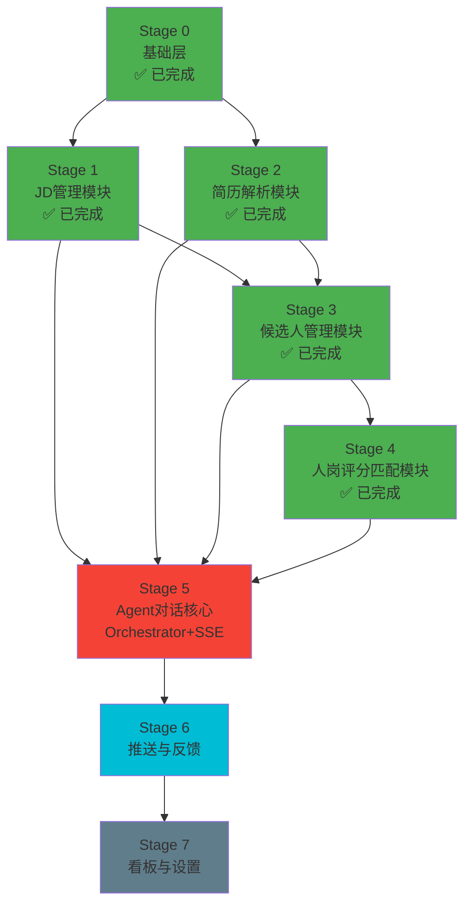

# 智能招聘 Agent 项目渐进式开发路线图

**版本:** v2.0
**更新日期:** 2026-07-09
**文档性质:** 分阶段开发实施计划
**配套文档:** [data-model.md](file:///e:/AI-WORK/Project-Work/recruitment-agent-2.0/docs/data-model.md)（数据模型单一事实来源）、[api-contract.md](file:///e:/AI-WORK/Project-Work/recruitment-agent-2.0/docs/api-contract.md)（API/SSE契约）

---

## 一、渐进式开发策略（修订版）

### 1.1 核心原则

**"基础先行、双路径调用、模块闭环、逐步验证"**

1. **基础先行（Stage 0）**：公共地基（数据库、Skill框架、LLM适配器、基础中间件）先于业务模块建成，作为所有Stage的共同基础
2. **双路径调用**：Skill有两种调用路径——
   - **直接调用路径**：REST API → Service层 → Skill（CRUD/表单驱动场景，Stage 1-4使用此路径即可闭环）
   - **Orchestrator路径**：SSE对话 → Task Orchestrator → R-P-R-A-R推理 → Skill调用（对话驱动场景，Stage 5引入）
3. **模块闭环验证**：每个Stage交付"表+API+Skill+前端页面"完整slice，可独立演示
4. **Skill契约唯一**：`skill.yaml`是Skill的**唯一契约定义**，Python `BaseSkill`仅作为运行时加载/校验/执行引擎

### 1.2 双路径架构说明

```
┌─────────────────────────────────────────────────────────┐
│                      Frontend                            │
│  ┌──────────────┐              ┌──────────────────┐      │
│  │ 表单/CRUD页面 │              │ 对话式任务中心     │      │
│  └──────┬───────┘              └────────┬─────────┘      │
└─────────┼───────────────────────────────┼────────────────┘
          │ REST API                       │ SSE Stream
          ▼                               ▼
┌──────────────────┐           ┌──────────────────────────┐
│  Service Layer   │           │  Task Orchestrator       │
│  (直接调用Skill)  │           │  (R-P-R-A-R推理循环)     │
└────────┬─────────┘           └────────────┬─────────────┘
         │                                   │
         └─────────────┬─────────────────────┘
                       ▼
              ┌─────────────────┐
              │  Skill Registry │
              │  BaseSkill      │
              │  (统一运行时)    │
              └────────┬────────┘
                       ▼
              ┌─────────────────┐
              │   LLM / Tools   │
              └─────────────────┘
```

**关键设计决策**：业务模块（JD/简历/评分/推送）在前4个Stage只使用"直接调用路径"即可完成闭环验证，**不需要**先构建Orchestrator。Orchestrator是对话体验的增强层，放在Stage 5集中构建。

### 1.3 Stage总览与依赖关系



**修订要点（对比v1.1）：**
- ✅ 新增 **Stage 0 基础层**（已实际完成的公共地基）
- ❌ 删除"Stage 2-4可并行"的错误表述——修正为**严格串行依赖链**：S2(简历)→S3(候选人)→S4(评分)
- ✅ 明确双路径架构，解决"Orchestrator是硬依赖却排最后"的矛盾
- ✅ Skill契约唯一性明确（skill.yaml为唯一源）

### 1.4 Stage依赖表（已修正）

| Stage | 名称 | 前置依赖 | 核心交付物 |
|-------|------|---------|-----------|
| **Stage 0** | 基础层 | Docker环境 | Docker环境、PostgreSQL+Redis+MinIO、SQLAlchemy/Alembic、LLM适配器、Skill Registry+BaseSkill、FastAPI骨架、统一API响应 |
| **Stage 1** | JD管理模块 | Stage 0 | jds/jd_templates表、JD CRUD+生成API、JD生成Skill v1、JD管理前端页面 |
| **Stage 2** | 简历解析模块 | Stage 0 | resumes表、简历上传/解析API、简历解析Skill、简历上传前端 |
| **Stage 3** | 候选人管理模块 | Stage 1+2 | candidates表、候选人CRUD API、候选人实体合并Skill、候选人列表前端 |
| **Stage 4** | 人岗评分匹配 | Stage 3 | match_scores表、匹配评分API、评分计算Skill、匹配报告前端 | ✅ 已完成 |
| **Stage 5** | Agent对话核心 | Stage 1-4 | tasks表、Task Orchestrator（R-P-R-A-R）、SSE端点、统一API契约、对话任务中心前端 |
| **Stage 6** | 推送与反馈 | Stage 5 | communications/feedback表、推送服务、推送/反馈Skill、推送管理前端 |
| **Stage 7** | 看板与设置 | Stage 5+6 | analytics表、数据看板、Skill管理页面、系统设置 |

---

## 二、Stage 0：基础层 ✅ 已完成

### 2.1 已完成内容

| 组件 | 状态 | 位置 |
|-----|------|------|
| Docker开发环境（PG+Redis+MinIO） | ✅ | [docker-compose.yml](file:///e:/AI-WORK/Project-Work/recruitment-agent-2.0/docker-compose.yml) |
| 项目初始化（uv+pyproject.toml） | ✅ | [pyproject.toml](file:///e:/AI-WORK/Project-Work/recruitment-agent-2.0/backend/pyproject.toml) |
| 数据库引擎+Session管理 | ✅ | [core/database.py](file:///e:/AI-WORK/Project-Work/recruitment-agent-2.0/backend/app/core/database.py) |
| Alembic迁移框架（初始迁移） | ✅ | [alembic/](file:///e:/AI-WORK/Project-Work/recruitment-agent-2.0/backend/alembic) |
| LLM适配器（OpenAI兼容/豆包） | ✅ | [agent/llm_adapter.py](file:///e:/AI-WORK/Project-Work/recruitment-agent-2.0/backend/app/agent/llm_adapter.py) |
| BaseSkill基类（校验+重试+合规检查） | ✅ | [agent/base_skill.py](file:///e:/AI-WORK/Project-Work/recruitment-agent-2.0/backend/app/agent/base_skill.py) |
| SkillRegistry（YAML加载+版本管理） | ✅ | [agent/skill_registry.py](file:///e:/AI-WORK/Project-Work/recruitment-agent-2.0/backend/app/agent/skill_registry.py) |
| FastAPI应用骨架+CORS+MinIO容错 | ✅ | [main.py](file:///e:/AI-WORK/Project-Work/recruitment-agent-2.0/backend/app/main.py) |
| 基础数据表（skills/skill_versions/skill_execution_logs/jds/jd_templates） | ✅ | 通过Alembic迁移创建 |
| 启动时Skill自注册到DB | ✅ | main.py `_sync_skills_to_db()` |

### 2.2 技术栈确认（以实际代码为准）

| 层级 | 技术选择 |
|-----|---------|
| Python版本 | 3.11+ |
| 包管理 | **uv**（非pip） |
| Web框架 | FastAPI |
| ORM | SQLAlchemy 2.0 (async) |
| 数据库迁移 | Alembic |
| LLM SDK | langchain-openai（OpenAI兼容格式，适配豆包Ark） |
| 数据校验 | Pydantic v2、jsonschema |
| 模板引擎 | Jinja2（Skill user prompt模板） |
| Skill定义格式 | **YAML**（skill.yaml + prompt.md + examples.yaml） |
| 代码规范 | Ruff |
| 启动命令 | `uv run uvicorn app.main:app --host 127.0.0.1 --port 8000` |

---

## 三、Stage 1：JD管理模块 ✅ 已完成（前端页随 PR-6 落地）

### 3.1 模块闭环定义（Slice清单）

| 类别 | 交付物 | 状态 |
|-----|-------|------|
| 数据表 | jds、jd_templates | ✅ |
| Skill | jd-generation v1.0.0（skill.yaml+prompt+2组few-shot） | ✅ |
| 后端API | POST /generate、GET /、GET /{id}、PUT /{id}、DELETE /{id} | ✅ |
| 持久化 | JD生成时自动写skill_execution_logs | ✅ |
| 前端页面 | JD列表页、JD生成表单、JD详情/编辑页 | ✅ 已完成 |
| 依赖基础件 | Stage 0（已全部就绪） | ✅ |

### 3.2 已验证能力

- ✅ AI生成JD（调用豆包LLM，~35-60秒，验证分数1.0，合规通过）
- ✅ CRUD完整验证（创建/查询/列表/更新/删除全部通过HTTP集成测试）
- ✅ Skill执行日志正确持久化（含输入/输出快照、执行时间、验证分数）

### 3.3 剩余工作：前端页面

前端技术栈：React 18 + TypeScript 5 + Ant Design 5 + Vite

需要开发：
1. JD列表页（表格+分页+状态筛选+关键词搜索）
2. JD生成表单（输入职位信息→调用POST /generate→Loading状态→展示结果）
3. JD详情/编辑页（查看/编辑生成的JD内容，支持发布/归档）

---

## 四、Stage 2：简历解析模块

### 4.1 模块闭环定义

| 类别 | 交付物 |
|-----|-------|
| 数据表 | resumes（详见[data-model.md](file:///e:/AI-WORK/Project-Work/recruitment-agent-2.0/docs/data-model.md) §3.1） |
| Skill | resume-parsing v1.0.0（PDF/DOCX解析→结构化输出） |
| 后端API | 文件上传MinIO、触发解析、查询解析结果 |
| 前端页面 | 简历上传页面、解析结果预览 |
| 依赖 | Stage 0（MinIO、Skill框架） |

### 4.2 验收标准（示例）
- PDF/DOCX简历上传成功率 > 95%
- 解析输出包含姓名/联系方式/教育/工作经历/技能
- 解析Skill输出符合JSON Schema

---

## 五、Stage 3：候选人管理模块

### 5.1 模块闭环定义

| 类别 | 交付物 |
|-----|-------|
| 数据表 | candidates（详见data-model.md §3.2） |
| Skill | candidate-merge v1.0.0（多简历合并为同一候选人）、candidate-profile v1.0.0（画像标签） |
| 后端API | 候选人CRUD、列表筛选、详情查看 |
| 前端页面 | 候选人列表、候选人详情档案页 |
| 依赖 | Stage 1（jds表已存在）、Stage 2（resumes表、简历解析完成） |

### 5.2 注意事项
- **必须串行**：candidates表通过resume_id关联resumes表，必须在Stage 2完成后开始
- FK约束：不允许在resumes表创建前创建带外键的candidates表

---

## 六、Stage 4：人岗评分匹配模块（✅ 已完成）

### 6.1 模块闭环定义

| 类别 | 交付物 | 状态 |
|-----|-------|------|
| 数据表 | match_scores（详见data-model.md §3.3） | ✅ |
| Skill | jd-candidate-matching v1.0.0（基于JD+简历计算多维匹配分） | ✅ |
| 后端API | POST /match-scores、POST /match-scores/batch、GET /match-scores/batch/{task_id}、GET /match-scores/{score_id}、GET /jds/{id}/ranking、GET /resumes/{id}/matches | ✅ |
| 前端页面 | 匹配报告页（ScoringReport）、候选人排名表、详情 Drawer、Resumes 真实匹配分、ResumeDetail 匹配面板 | ✅ |
| 依赖 | Stage 1 + Stage 3（jds+candidates都必须存在） | ✅ 已满足 |

### 6.2 注意事项
- **必须串行**：match_scores表同时引用jds和candidates，必须在Stage 3完成后开始
- 评分维度：技能匹配、经验匹配、学历匹配、综合推荐度
- 综合分加权公式：`overall = round(0.5*skill + 0.3*exp + 0.2*edu, 1)`（详见后端 MatchService）

---

## 七、Stage 5：Agent对话核心（Orchestrator + SSE）

### 7.1 模块定位

Stage 5是**体验增强层**，引入对话式交互。前4个Stage的模块在Stage 5之前已经可以通过REST API+表单页面独立工作，Stage 5为其增加"对话驱动"的新交互方式。

### 7.2 模块闭环定义

| 类别 | 交付物 |
|-----|-------|
| 数据表 | tasks、executions |
| 核心组件 | Task Orchestrator（R-P-R-A-R循环）、SSE事件推送、Tool Router |
| API契约 | POST /api/agent/chat、GET /api/agent/tasks/{id}/stream（SSE）、POST /api/agent/execute-plan、POST /api/agent/skip-to-score（详见api-contract.md） |
| 前端页面 | 对话任务中心（page-1） |
| 依赖 | Stage 1-4（所有业务Skill已就绪） |

### 7.3 SSE事件契约（在此固化，前后端统一）

```typescript
// 统一事件信封
interface SSEEvent {
  type: 'thinking' | 'plan' | 'tool_call' | 'progress' | 'result' | 'error' | 'warning' | 'system';
  task_id: string;
  step_id?: string;
  timestamp: string;
  data: any;
}
```

> **注意**：SSE事件类型和PlanStep结构在api-contract.md中正式定义，Stage 5构建时严格遵循，禁止前后端各自定义。

### 7.4 R-P-R-A-R阶段I/O Schema

每个阶段的输入/输出在api-contract.md中定义为正式JSON Schema，不再仅用"示例JSON"。

---

## 八、Stage 6-7：推送反馈与看板设置

（略，依赖Stage 5的Orchestrator，后续补充详细slice定义）

---

## 九、开发规范

### 9.1 每个Stage的执行顺序

```
1. 更新data-model.md（表设计）
2. 编写SQLAlchemy模型
3. alembic revision --autogenerate + upgrade head（验证表结构）
4. 创建Pydantic Schema（请求/响应）
5. 创建skill.yaml + prompt.md + examples.yaml（业务Skill）
6. 实现Service层业务逻辑（调用Skill、写日志）
7. 实现API路由
8. 编写API集成测试（httpx调用验证）
9. 开发前端页面对接API
10. 端到端验收（表单→API→Skill→DB→页面展示）
```

### 9.2 Skill开发规范

- **唯一契约**：每个Skill必须包含 `skill.yaml`（元数据+I/O Schema）、`prompt.md`（System Prompt + User Template，用`---USER_TEMPLATE---`分隔）、`examples.yaml`（few-shot示例）
- **目录结构**：`app/agent/skills/{skill_id}/v{major}_{minor}_{patch}/`
- **运行时**：BaseSkill自动加载YAML，提供输入校验、输出校验、合规检查、自动重试
- **禁止**：不要在Python代码中硬编码prompt或schema，必须写在YAML/Markdown文件中

### 9.3 部署/启动命令（统一）

```bash
# 1. 启动Docker环境（首次或重启后）
docker compose up -d

# 2. 安装/同步依赖
cd backend
uv sync

# 3. 执行数据库迁移
uv run alembic upgrade head

# 4. 启动开发服务器
uv run uvicorn app.main:app --host 127.0.0.1 --port 8000 --reload

# 5. 访问
# API文档: http://127.0.0.1:8000/docs
# 健康检查: http://127.0.0.1:8000/health
```
